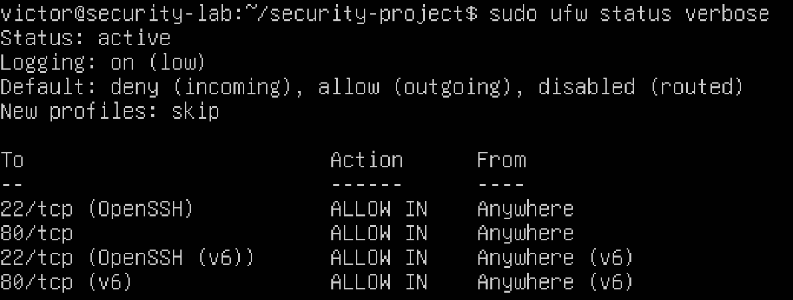
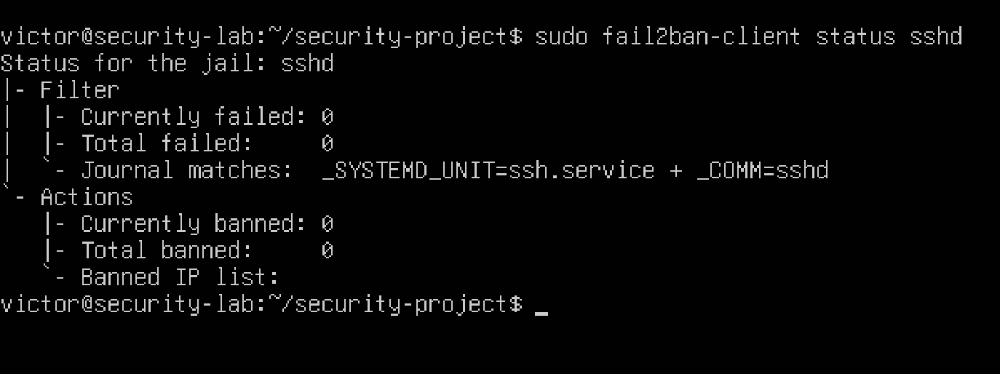
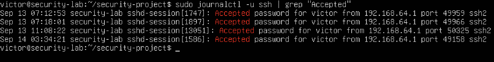
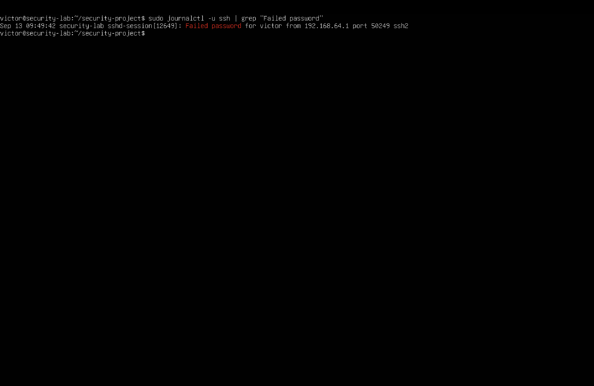

# Linux Security Investigation

## Project Overview

In this project, I built and secured an Ubuntu Linux server in a virtual machine. I configured SSH, a UFW firewall, an Nginx web server, and Fail2ban. I also investigated web and SSH logs to identify failed authentication attempts and understand how suspicious activity can be detected.

## Tools & Technology

- Ubuntu Linux
- SSH
- UFW Firewall
- Nginx
- Fail2ban
- Linux system logs
- grep
- awk
- tail
- journalctl

## Security Investigation

I generated a failed SSH login attempt from my host machine to simulate suspicious authentication activity. I then investigated the SSH logs and confirmed that Fail2ban detected the failed attempt.

During the investigation, I:

- Filtered SSH logs for authentication failures.
- Identified the source IP address and targeted username.
- Checked for successful SSH logins from the same IP address.
- Used Fail2ban to monitor failed SSH authentication attempts.
- Compared failed and successful authentication events to determine whether the activity was suspicious.

## Findings

The failed SSH authentication attempt came from `192.168.64.1`, my host machine. Fail2ban detected one failed attempt but did not ban the IP because the maximum retry limit was five.

I checked the successful SSH logins and found that the same IP had connected successfully. Since it was my known host and the failed login was intentionally generated, I determined that the activity was not malicious.

## What I Learned

- How SSH provides remote access to a Linux server.
- How UFW controls incoming network traffic.
- How to investigate Nginx and SSH logs.
- How grep, awk, tail, and journalctl can be used to filter and analyze logs.
- How Fail2ban detects repeated login failures.
- How to compare authentication events and determine whether activity is suspicious.

## Project Screenshots

### UFW Firewall Configuration

### Fail2Ban SSH Monitoring

### Successful SSH Login Investigation

### Failed SSH Login Detection

